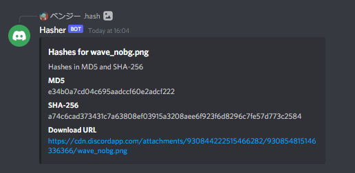

# Hasher
Hasher is a Discord bot that lets you get checksum hashes of an attached file or link to a file

### Screenshots:
##### Command Example

##### Result

----

### Current Commands:
- `.hash` - Gets the MD5 and SHA256 hash of an attached file
- ----

### Planned:
- Add file extension to the result embed
- Move bot configuration to a JSON file for easy control
- Add support for getting the hash of a file from a link
- ----

### Compiling from Source
- Clone the source using `git clone https://github.com/VAVE-Studios/Hasher` or the GitHub Desktop app
- Open the solution in Visual Studio 2022 and build a configuration
- ----

## For support or questions, please join our [Discord server](https://discord.gg/zAT7gKdxA6)
